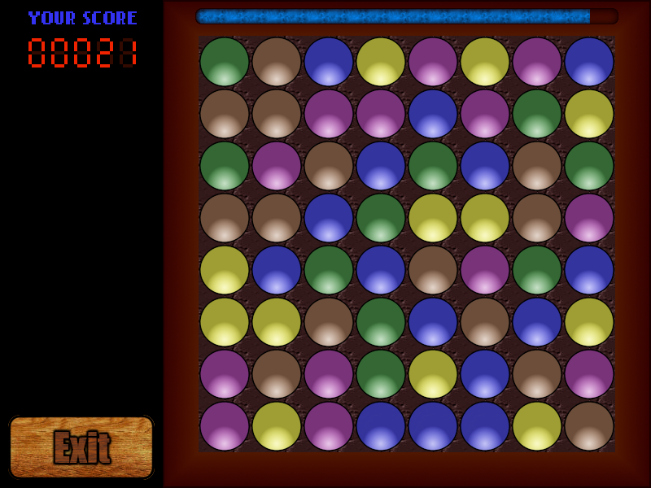

# Connect3

A Bejeweled-like game written in C++/SDL2.

### How to play?
Controlled entirely by a mouse, the objective of this game is to swap neighboring elements
in order to create chains of at least three identical objects. The connected elements disappear
from the board, and new ones fall in from the top.  
Removing any element from a game field gains you one point. Sometimes a successful swap  
results in a cascade of consecutive chains. Every element removed in a second consecutive cascade  
is worth two points, three points in third cascade etc. The multiplier resets back to 1 with every swap.
You have exactly one minute to get as high score as possible.

### Building information
#### Required libraries
Connect3 requires [SDL2 library](https://www.libsdl.org/download-2.0.php) with [SDL_image](https://www.libsdl.org/projects/SDL_image/) and [SDL_ttf](https://www.libsdl.org/projects/SDL_ttf/) submodules. Please make sure to install the developers' version if you wish to build the game from source.
Connect3 uses [Catch2](https://github.com/catchorg/Catch2) library for unit testing purposes, but its installation is not required if you do not wish to run unit tests yourself.
#### Linux
Use the provided Makefile. Issue `make` to build the program, and `make run` to execute it. If you have Catch2 library installed, `make test` executes unit tests.
Please make sure that SDL2 libraries (dev version) are installed on your system.  
The game makes use of SDL_image and SDL_ttf submodules, so the respective libraries are also required - these are available via most package managers.

#### Windows
Use VisualStudio or other tool to compile the code. Please note that the game requires SDL2 library - do make sure that it's properly installed. I have successfully compiled and ran this game
with CodeBlocks + MinGW on Windows XP system. LazyFoo' has an extensive [tutorial on this subject](http://lazyfoo.net/tutorials/SDL/01_hello_SDL/windows/codeblocks/index.php) which I wholeharteadly recommend.

 
### License information
Unless stated otherwise in the individual files,
the entire content of this repository is available under the **MIT License**
found in the [LICENSE file](LICENSE).

### Screencasts

